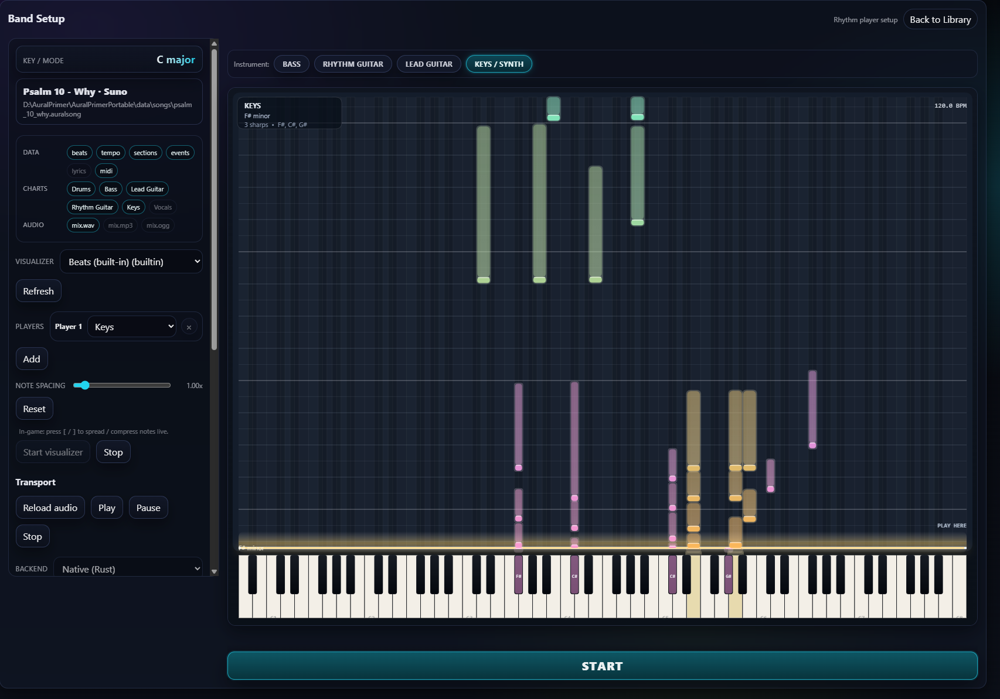

# AuralPrimer — data-driven music learning, ear & instrument practice

AuralPrimer turns any song you own into a playable practice surface. Drop
in an audio file or a Suno stem export, and the pipeline does the rest:
stem separation, beat/tempo analysis, per-instrument transcription, and
a falling-note in-game view that scrolls toward a "play here" line you
can adjust on the fly.



> The shot above is the in-game **Band Setup** view of the Keys/Synth lane
> for a real Suno piano stem the pipeline transcribed. Notes fall toward
> the "PLAY HERE" line; the bright cap at the bottom of each pill is the
> attack, the fading tail above is the sustain. The detected key signature
> (`F# minor, 3 sharps`) is read straight off the note distribution by
> the in-process Krumhansl–Schmuckler analyzer in `viz-tab`. Press
> <kbd>[</kbd> / <kbd>]</kbd> in-game to spread / compress the falling
> notes StepMania-style.

## What's in this repo

This is a two-app desktop suite plus the pipelines, plugins, and research
that feed them.

1. **AuralPrimer** — the gameplay app. Loads `.auralsong` packs, plays
   them, drives the visualizer plugins, and routes live MIDI for
   practice.
2. **AuralStudio** — the authoring app. Imports raw audio / stem folders,
   runs the pipeline, and emits `.auralsong` packs the game can load.
3. **Python sidecar pipeline** (`python/ingest/`) — extraction,
   stem-separation, and per-instrument transcription tooling shipped as
   PyInstaller binaries so users don't need a Python install.
4. **Visualizer SDK + plugins** (`packages/viz-sdk`, `visualizers/`) —
   pluggable canvas renderers (drum highway, beats, tab, piano-roll,
   chord-lane, lyrics) that all consume the same canonical transport
   state.

## Quickstart

```sh
git clone https://github.com/wirelessdreamer/AuralPrimer.git
cd AuralPrimer
npm ci              # installs the JS workspace + downloads model packs that ship in CI
cargo test --workspace
npm test
python -m pip install -e python/ingest    # only needed if you want to call the pipeline from source

# Build a portable bundle (Windows): produces AuralPrimerPortable/{AuralPrimer.exe, AuralStudio.exe, ...}
pwsh ./create_portable.ps1 -PortableRoot ./AuralPrimerPortable
```

See [`BUILDING.md`](BUILDING.md) for the full install / test / package
matrix and [`docs/local-dev-prereqs.md`](docs/local-dev-prereqs.md) for
OS-level prerequisites.

## Design principles

- **Test-driven development.** Tests first, implementation second; CI
  stays green.
- **AuralSong-first runtime.** AuralPrimer consumes `.auralsong` packs as
  canonical content. The folder watcher pulls in new packs without a
  restart.
- **Deterministic imports.** Cacheable, reproducible, versioned outputs.
- **Local-first shipping.** Required tooling lives in the desktop
  artifact. ML model weights are NOT bundled in the installer — they
  download/import into `assets/models/` on first use.
- **Plugin-first visualization.** Visualizers stay decoupled from the
  runtime via the `viz-sdk` plugin SDK.
- **Rights-neutral importer scope.** PRs for source-specific proprietary
  game/DLC archive importers are out of scope.

## Third-party components & attribution

AuralPrimer is free software ([GPL-3.0-or-later](LICENSE)) with no commercial
aspirations — the goal is integrating the best open solutions in a
user-friendly way. It stands on open-source music-ML research and tooling, and
the attribution list below stays complete both because the licenses require it
and because credit is owed. **For every neural model we verify the trained
*weights* license separately from the code license** (they frequently differ —
open-code / unlicensed-weights splits are common). The license gate for what
ships:

- **Code dependencies** must be GPLv3-compatible. MIT / Apache-2.0 / BSD /
  ISC / MPL-2.0 / CC0 / LGPL / GPL all qualify — this is nearly every
  open-source license in practice.
- **Model weights & datasets** must carry an *explicit* redistributable
  license. Non-commercial terms (e.g. CC BY-NC-SA) are acceptable for this
  project; weights with **no stated license at all** remain excluded — with no
  grant, nobody has redistribution rights, non-commercial or otherwise.

### Who makes what we use

One row per maker, ordered by layer — models first, then ML runtime, app
shell, and native audio/MIDI:

| Layer | Organization / maintainer | What AuralPrimer uses from them | License |
|---|---|---|---|
| Model | **Meta AI · FAIR** — Défossez et al. | [**Demucs**](https://github.com/facebookresearch/demucs) — stem separation | MIT (code + weights) |
| Model | **Sony AI** — Tan · Cheuk · Mitsufuji | [**MR-MT3**](https://github.com/gudgud96/MR-MT3) — neural drum transcription (+ [`mt3-infer`](https://github.com/openmirlab/mt3-infer) wrapper) | MIT (code + weights) |
| Model | **Google Research · Magenta** | [**MT3**](https://github.com/magenta/mt3) — the architecture MR-MT3 is fine-tuned from | Apache-2.0 |
| Model | **Spotify · Audio Intelligence Lab** | [**Basic Pitch**](https://github.com/spotify/basic-pitch) — piano / polyphonic melodic transcription | Apache-2.0 |
| Model | **CPJKU · JKU Linz** — Foscarin · Schlüter · Widmer | [**Beat This!**](https://github.com/CPJKU/beat_this) — beat / downbeat / meter (drives the editor grid) | MIT (code + weights) |
| Model | **NYU MARL · Northwestern** — Kim · Salamon · Bello · Morrison | [**CREPE**](https://github.com/marl/crepe) + [**torchcrepe**](https://github.com/maxrmorrison/torchcrepe) — bass / guitar pitch | MIT |
| Runtime | **Meta Platforms** — PyTorch project | [**PyTorch**](https://github.com/pytorch/pytorch) (`torch` · `torchaudio` · `torchvision`) — ML runtime | BSD |
| Runtime | **Hugging Face** | [**transformers**](https://github.com/huggingface/transformers) — model architectures | Apache-2.0 |
| Runtime | **Lightning AI** — William Falcon | [**PyTorch Lightning**](https://github.com/Lightning-AI/pytorch-lightning) — inference scaffolding | Apache-2.0 |
| Runtime | **Phil Wang** (lucidrains) | [**x-transformers**](https://github.com/lucidrains/x-transformers) · [**rotary-embedding-torch**](https://github.com/lucidrains/rotary-embedding-torch) | MIT |
| Runtime | **NumFOCUS community** — Brian McFee et al. | [**NumPy**](https://github.com/numpy/numpy) · [**SciPy**](https://github.com/scipy/scipy) · [**scikit-learn**](https://github.com/scikit-learn/scikit-learn) · [**librosa**](https://github.com/librosa/librosa) (onset / CQT / tempo) | BSD · ISC |
| Runtime | **Bastian Bechtold** · libsndfile team | [**soundfile**](https://github.com/bastibe/python-soundfile) — audio I/O | BSD (LGPL backend, dynamic) |
| Runtime | **The FFmpeg project** | [**ffmpeg**](https://ffmpeg.org) — decode binary | LGPL-2.1+ (dynamic) |
| Runtime | **Microsoft** · **ONNX / LF AI & Data** | [**onnxruntime**](https://github.com/microsoft/onnxruntime) + [**onnx**](https://github.com/onnx/onnx) — opt-in drum-CRNN inference / export | MIT · Apache-2.0 |
| App | **Tauri WG · Commons Conservancy** | [**Tauri v2**](https://github.com/tauri-apps/tauri) — desktop shell + dialog/shell plugins | MIT / Apache-2.0 |
| App | **VoidZero** — Evan You · Anthony Fu | [**Vite**](https://github.com/vitejs/vite) · [**Vitest**](https://github.com/vitest-dev/vitest) — build & test | MIT |
| App | **Microsoft** | [**TypeScript**](https://github.com/microsoft/TypeScript) · [**Playwright**](https://github.com/microsoft/playwright) | Apache-2.0 |
| Native | **RustAudio + independent Rust** | [**cpal**](https://github.com/RustAudio/cpal) · [**rtrb**](https://github.com/mgeier/rtrb) · [**symphonia**](https://github.com/pdeljanov/Symphonia) · [**midir**](https://github.com/Boddlnagg/midir) · [**midly**](https://github.com/kovaxis/midly) — native audio/MIDI | Apache / MIT / MPL-2.0 |

*Lineage: Google/Magenta's **MT3** → Sony's **MR-MT3** (fine-tuned for drums).
Full per-component detail — including build/test-only deps — is in the tables
below.*

### Music-ML models & audio analysis (the differentiating stack)

| Component | Role in AuralPrimer | Made by | License (code / weights) |
|---|---|---|---|
| [**Demucs**](https://github.com/facebookresearch/demucs) (`htdemucs_6s`) | Stem separation (vocals/drums/bass/guitar/keys/other) | Meta AI / FAIR — Alexandre Défossez | MIT / **MIT** |
| [**MR-MT3**](https://github.com/gudgud96/MR-MT3) (`mr_mt3` ckpt) + [**mt3-infer**](https://github.com/openmirlab/mt3-infer) | Neural drum transcription (which drum + velocity) | Sony AI — Hao Hao Tan, Kin Wai Cheuk, Yuki Mitsufuji et al.; wrapper by *openmirlab* | MIT / **MIT** |
| [**MT3**](https://github.com/magenta/mt3) (lineage) | Base multi-track transcription architecture MR-MT3 derives from | Google Research · Magenta | Apache-2.0 / Apache-2.0 |
| [**Basic Pitch**](https://github.com/spotify/basic-pitch) | Piano / polyphonic melodic transcription | Spotify — Audio Intelligence Lab | Apache-2.0 / Apache-2.0 |
| [**Beat This!**](https://github.com/CPJKU/beat_this) | Beat / downbeat / **meter** tracking (drives the editor grid) | CPJKU, JKU Linz — Foscarin, Schlüter, Widmer | MIT / **MIT** |
| [**torchcrepe**](https://github.com/maxrmorrison/torchcrepe) + [**CREPE**](https://github.com/marl/crepe) | Monophonic bass / guitar pitch tracking | Max Morrison (Northwestern) · CREPE by NYU MARL (Kim, Salamon, Bello) | MIT / **MIT** |
| [**librosa**](https://github.com/librosa/librosa) | DSP: onset detection, CQT/spectrogram, tempo analysis | librosa dev team (Brian McFee, NYU) | ISC |

### ML runtime & Python libraries

| Component | Made by | License |
|---|---|---|
| [**PyTorch**](https://github.com/pytorch/pytorch) (`torch`, `torchaudio`, `torchvision`) | Meta Platforms (PyTorch project) | BSD-2/3-Clause |
| [**PyTorch Lightning**](https://github.com/Lightning-AI/pytorch-lightning) | Lightning AI (William Falcon) | Apache-2.0 |
| [**transformers**](https://github.com/huggingface/transformers) | Hugging Face, Inc. | Apache-2.0 |
| [**onnxruntime**](https://github.com/microsoft/onnxruntime) (opt-in drum-CRNN inference) | Microsoft | MIT |
| [**onnx**](https://github.com/onnx/onnx) (drum-CRNN ONNX export; pinned 1.18.0 for ml-dtypes compat) | ONNX community (LF AI & Data Foundation) | Apache-2.0 |
| [**x-transformers**](https://github.com/lucidrains/x-transformers), [**rotary-embedding-torch**](https://github.com/lucidrains/rotary-embedding-torch) | Phil Wang (lucidrains) | MIT |
| [**NumPy**](https://github.com/numpy/numpy), [**SciPy**](https://github.com/scipy/scipy), [**scikit-learn**](https://github.com/scikit-learn/scikit-learn) | NumFOCUS-sponsored communities | BSD-3-Clause |
| [**soundfile**](https://github.com/bastibe/python-soundfile) (+ [**libsndfile**](https://github.com/libsndfile/libsndfile)) | Bastian Bechtold · libsndfile team | BSD-3-Clause (LGPL backend, dynamic) |
| [**beartype**](https://github.com/beartype/beartype) | Cecil Curry | MIT |
| [**ffmpeg**](https://ffmpeg.org) (bundled binary) | The FFmpeg project | LGPL-2.1+ (dynamic) |
| [**PyInstaller**](https://github.com/pyinstaller/pyinstaller) (build tool) | PyInstaller Development Team | GPL-2.0+ w/ bootloader exception |

### Desktop app, frontend & build

| Component | Made by | License |
|---|---|---|
| [**Tauri v2**](https://github.com/tauri-apps/tauri) (+ `@tauri-apps/api`, dialog/shell plugins) | Tauri Working Group / Commons Conservancy | MIT / Apache-2.0 |
| [**Vite**](https://github.com/vitejs/vite), [**Vitest**](https://github.com/vitest-dev/vitest) | VoidZero (Evan You / Anthony Fu) | MIT |
| [**TypeScript**](https://github.com/microsoft/TypeScript), [**Playwright**](https://github.com/microsoft/playwright) | Microsoft | Apache-2.0 |
| [**ajv**](https://github.com/ajv-validator/ajv) (JSON Schema) | Evgeny Poberezkin | MIT |
| [**fflate**](https://github.com/101arrowz/fflate) (in-browser zip) | Arjun Barrett | MIT |
| [**jsdom**](https://github.com/jsdom/jsdom) (test DOM) | jsdom project (Domenic Denicola et al.) | MIT |

### Native (Rust) crates

| Component | Made by | License |
|---|---|---|
| [**cpal**](https://github.com/RustAudio/cpal) (native audio out) | RustAudio | Apache-2.0 |
| [**rtrb**](https://github.com/mgeier/rtrb) (realtime ring buffer) | Matthias Geier | MIT / Apache-2.0 |
| [**symphonia**](https://github.com/pdeljanov/Symphonia) (pure-Rust decode) | Philip Deljanov | MPL-2.0 |
| [**midir**](https://github.com/Boddlnagg/midir) / [**midly**](https://github.com/kovaxis/midly) (MIDI I/O + `.mid` parse) | Patrick Reisert · Martín Andrighetti | MIT · Unlicense |
| [**tokio**](https://github.com/tokio-rs/tokio) (async runtime) | tokio-rs | MIT |
| [**serde**](https://github.com/serde-rs/serde)(+`json`/`yaml`) | David Tolnay | MIT / Apache-2.0 |
| [**zip**](https://github.com/zip-rs/zip2), [**sha2**](https://github.com/RustCrypto/hashes), [**hex**](https://github.com/KokaKiwi/rust-hex), [**notify**](https://github.com/notify-rs/notify) | zip-rs · RustCrypto · rust-hex · notify-rs | MIT / Apache-2.0 / CC0 |

> **License-gate note.** Checked against primary sources: (1) the *Demucs*
> `htdemucs_*` weights are **MIT** (the CC-BY-NC claim circulating in
> third-party repackagings conflates them with the 2019 Conv-TasNet research
> models); (2) `madmom`'s trained models are CC-BY-NC-SA — that once
> disqualified them under the project's former commercial gate, but under the
> current policy (open source, non-commercial acceptable) they are admissible;
> Beat This! (MIT) remains the meter-tracking choice on quality and
> maintenance grounds, not licensing. Pin exact model revisions
> (HF/checkpoint) so a future card relicense can't change terms silently.

## Research & methodology — first class

We treat transcription quality as a research problem and publish the
numbers, the corpora, the algorithms, and the reproducibility commands
alongside the code. The work directly informs production defaults —
nothing in the ingest pipeline is shipped without head-to-head benchmark
evidence captured in a document below.

### Top-tier transcription stack (per instrument)

Ingest auto-selects a **primary transcriber per instrument** — the
`gameplay_default` profile (`transcription.py`) — backed by a fail-safe
fallback chain so machines without the neural checkpoints still import.
The current production picks:

| Instrument | Top-tier transcriber | Why it leads | Fallback chain |
|------------|----------------------|--------------|----------------|
| **Drums** | **`mr_mt3_drums`** — neural MT3 ADT (GPU/CPU auto) | catches the dense hi-hats / ghost notes the DSP engines miss (their E-GMD recall collapses to F1 ≈ 0.13) | beat-conditioned multiband → spectral-flux multiband → adaptive-beat-grid → DSP bandpass — used when the MT3 checkpoint/runtime is absent |
| **Bass** | **`torchcrepe`** — neural monophonic pitch (MIT) | octave-clean (~0.3% octave jumps vs ~45% for Basic Pitch), tighter low register, ~9× faster | YIN octave+HPS fix → adaptive → YIN-bass80 → octave-fix |
| **Guitar — lead** | **`torchcrepe`** — monophonic | octave-clean, ~6–8× faster than the DSP chain | melodic-adaptive → octave-fix → combined → Basic Pitch |
| **Guitar — rhythm** | **`melodic_hpss_combined`** — HPSS + onset (polyphonic) | keeps the chord voices a monophonic tracker drops | melodic-adaptive → octave-fix → combined |
| **Keys / piano** | **`piano_auto`** — scored gate: Basic Pitch → PTI (Edwards/Kong) cleanup | picks the best-scoring engine per stem; the tuned `piano_chord_supplement` path benchmarks **F1 0.928 / precision 0.981** on the synthetic piano corpus | PTI-consensus-clean → PTI-clean → polyphonic-clean |
| **Vocals** | *(no pitch transcription)* | vocals drive lyric alignment, not a note chart | — |

Alternate profiles are selectable per import: `fidelity_midi` (denser
symbolic output for A/B review) and `research_ab` (every local candidate,
defaults unchanged). Distorted/electric guitar is a known frontier
(rendered-tone onset-F1 ceiling ~0.78–0.84) — see the amp-tone research doc.

Per-case breakdowns, JSON reports, reproducibility commands, and the
"what didn't work and why" notes live in the docs below.

### Benchmark corpora (what the numbers above are measured against)

Every shipped pick is scored against annotated ground truth, not vibes.
The corpora below back the head-to-head numbers; all are freely
redistributable and every link resolves. Adapters that turn each into the
canonical event list the `gt-benchmark` runner consumes live under
[`python/ingest/src/aural_ingest/dataset_adapters/`](python/ingest/src/aural_ingest/dataset_adapters/).

| Instrument | Benchmark corpus | License | What it validates |
|------------|------------------|---------|-------------------|
| **Drums** | [**E-GMD v1.0.0**](https://magenta.withgoogle.com/datasets/e-gmd) — Expanded Groove MIDI Dataset (Google Magenta; 444.5 h, 45k sequences, 43 kits) | CC BY 4.0 | per-class onset F1 (kick / snare / hi-hat / toms / cymbals), stratified across style · drummer · tempo |
| **Bass** | [**GuitarSet**](https://zenodo.org/records/3371780) — low strings (hex-debleeded E/A), used as a bass proxy | CC BY 4.0 | monophonic low-register pitch F1 |
| **Guitar** | [**GuitarSet**](https://zenodo.org/records/3371780) (mic) + [**Guitar-TECHS**](https://zenodo.org/records/14963133) (direct-input + amp-mic electric) | CC BY 4.0 | acoustic + electric note F1, lead vs rhythm |
| **Keys / piano** | in-house synthetic corpus (authored MIDI → rendered WAV) · optional [**MAESTRO v3.0.0**](https://magenta.tensorflow.org/datasets/maestro) for real grand-piano timbre | project-owned · CC BY-NC-SA 4.0 | isolated-note lower bound (synthetic) → realistic-timbre ceiling (MAESTRO, gated on `AURAL_MAESTRO_ROOT`) |

Datasets carry attribution obligations (the CC BY family) — this table
is that attribution; keep it in sync when a benchmark round adds a corpus.
**Vocals** and **stem separation** currently ship without an in-house
benchmark; the intended corpora (MIR-ST500 for vocal pitch, MUSDB18-HQ for
separation SDR) and the harness to run them are specced in the
[model-upgrades plan](docs/model-upgrades-plan-2026-07-07.md).

### Research docs (start here)

- [**Piano transcription cleanup deep-dive — 2026-06-20**](docs/research-piano-cleanup-deep-dive-2026-06-20.md)
  Standalone narrative of the keys F1=0.706 → 0.928 climb. Tells each
  of the four steps end-to-end: the failure mode found by inspecting
  the previous step's output, the fix's gating contract, per-case
  numbers, and the "what didn't work" log (naive ensembles, onset-
  threshold sweeps, other engines). The doc to read first if you
  want the story behind the headline number.

- [**Ground-truth benchmarks — 2026-06-14**](docs/research-ground-truth-benchmarks-2026-06-14.md)
  Full per-instrument deep dive across all four instruments. Builds
  the annotated-corpus benchmark harness, ships dataset adapters for
  [E-GMD](https://magenta.withgoogle.com/datasets/e-gmd) /
  [GuitarSet](https://zenodo.org/records/3371780) /
  [Guitar-TECHS](https://zenodo.org/records/14963133), documents every tuned variant we
  tried (the wins AND the failures), and pins reproducibility commands
  so anyone can re-run a sweep with one `aural_ingest gt-benchmark`
  invocation. Covers drums, bass, guitar, and the round summary for
  keys (deep-dive doc above expands the keys section).

- [**ADT architecture deep-dive — 2026-05-07**](docs/research-deep-dive-adt-2026-05-07.md)
  2024–2025 ADT / transcription literature scan that revised 10
  architectural assumptions baked into the original pipeline. Each
  assumption is checked against published work, the resulting paths-
  forward list is the source of the current production-default trail.

- [**Electric-guitar amp-tone transcription — 2026-06-27**](docs/research-guitar-amptone-2026-06-27.md)
  Adversarially-verified research on the distorted/electric-guitar
  frontier: why general models collapse on real amp tone, the amp-tone
  augmentation lever (the dominant fix), license-clean datasets/assets,
  and a ranked plan. Sets the ~0.78–0.84 onset-F1 ceiling cited above.

- [**Research decision gates**](docs/research-decision-gates.md)
  The locked-in production defaults the rest of the codebase reads from
  (beat/tempo backend, stem-separator policy, benchmark thresholding
  stance). Updated whenever a benchmark round flips a decision.

- [`docs/CLAUDE_CODE_RESUME_PLAN.md`](docs/CLAUDE_CODE_RESUME_PLAN.md)
  Resumable v0.2 task plan (synth corpus, ADTOF integration, Demucs
  gate, real Basic Pitch, multi-label CRNN, real-audio fixtures).

- [`DRUM_TRANSCRIPTION_ALGORITHM_NOTES.md`](DRUM_TRANSCRIPTION_ALGORITHM_NOTES.md),
  [`TRANSCRIPTION_RECOVERY_NOTES.md`](TRANSCRIPTION_RECOVERY_NOTES.md),
  [`TRANSCRIPTION_REGRESSION_HISTORY.md`](TRANSCRIPTION_REGRESSION_HISTORY.md)
  Pre-rewrite recovery context (lost-tree recovery from 2026-03-03);
  preserved because the algorithm choices in `python/ingest/src/aural_ingest/algorithms/`
  trace back through this material.

### How a benchmark round works

1. Pick an annotated corpus and pick / write a dataset adapter under
   `python/ingest/src/aural_ingest/dataset_adapters/`.
2. Run `aural_ingest gt-benchmark --dataset <name> --algorithm <one> --algorithm <other> ...`
   The runner registers the requested algorithms, scores each against
   the corpus's reference events with greedy onset matching, and emits
   a JSON report under `benchmarks/{drums,melodic}/gt_runs/`.
3. Read the per-case breakdown. If a variant Pareto-dominates the
   production default (every case strictly improves or stays unchanged
   on F1 / precision / recall), promote it; otherwise ship it as a
   workspace candidate.
4. Append the round's results table + reproducibility command + the
   "what didn't work" log to
   `docs/research-ground-truth-benchmarks-<date>.md` and update the
   summary scoreboard above.

The harness lives at
[`python/ingest/src/aural_ingest/ground_truth_benchmark.py`](python/ingest/src/aural_ingest/ground_truth_benchmark.py)
and the CLI subcommand is documented in
[`docs/ingest-pipeline.md`](docs/ingest-pipeline.md).

## Docs (full index)

Authoritative requirements + planning:

- [`spec.md`](spec.md) — app boundaries, hard constraints, MIDI/audio rules
- [`wip.md`](wip.md) — living implementation tracker (milestones, in-flight tasks, decisions)
- [`docs/roadmap.md`](docs/roadmap.md) — milestones from MVP to v1
- [`docs/risk-register.md`](docs/risk-register.md) — technical risks and mitigations

Architecture and contracts:

- [`docs/architecture.md`](docs/architecture.md) — system overview, module boundaries, runtime flows
- [`docs/auralsong-spec.md`](docs/auralsong-spec.md) — `.auralsong` format, event model, versioning/migrations
- [`docs/auralsong-deliverable.md`](docs/auralsong-deliverable.md) — deterministic pack build contract
- [`docs/ingest-pipeline.md`](docs/ingest-pipeline.md) — Python pipeline DAG, stage plugins, caching, CLI contract
- [`docs/visualization-plugins.md`](docs/visualization-plugins.md) — visualization plugin API + loading model
- [`docs/audio-codec-policy.md`](docs/audio-codec-policy.md) — host playback uses Rust/Symphonia; FFmpeg stays in the ingest sidecar
- [`docs/midi-keyboard-testing.md`](docs/midi-keyboard-testing.md) — hardware MIDI input verification path

Process, tooling, packaging:

- [`docs/local-dev-prereqs.md`](docs/local-dev-prereqs.md) — OS-level prerequisites
- [`BUILDING.md`](BUILDING.md) — install / test / build / portable-package instructions
- [`docs/testing-strategy.md`](docs/testing-strategy.md) — TDD layers, fixtures, golden tests
- [`docs/packaging-ci.md`](docs/packaging-ci.md) — bundling sidecars / decoders / models, CI build matrix
- [`docs/performance-baselines.md`](docs/performance-baselines.md) — hardware profiles backing benchmark thresholds

## Monorepo layout

```text
/AuralPrimer
  /apps
    /game                   # AuralPrimer gameplay app (Tauri)
    /desktop                # AuralStudio authoring app (Tauri)
  /packages
    /core-music             # shared schema + utilities (TS + Rust)
    /viz-sdk                # visualization plugin SDK (TS)
    /auralsong              # AuralSong reader/writer/validator (TS + Rust)
  /python
    /ingest                 # Python extraction pipeline (built into sidecars)
      /src/aural_ingest
        /algorithms         # per-instrument transcribers + the new piano cleanup family
        /dataset_adapters   # E-GMD / GuitarSet / Guitar-TECHS / piano_synthetic
        /ground_truth_benchmark.py
  /visualizers
    /viz-beats              # beat/section grid
    /viz-drum-highway       # drum lanes from host-provided MIDI events
    /viz-fretboard          # fretboard cursor placeholder
    /viz-lyrics             # data-driven karaoke lyrics
    /viz-nashville          # chord-lane placeholder
    /viz-tab                # piano-roll + tab renderer for keys/bass/guitar
  /benchmarks               # frontend/python/rust benches + thresholds.yml + reports
  /scripts                  # Node + PowerShell launchers for build/bench/portable
  /assets
    /models                 # downloaded on first use; NOT bundled in installer
    /test_fixtures
  /docs
    /assets/screenshots
```

## Packaging stance ("no external runtime dependencies")

At runtime, users should not need a separate Python / FFmpeg / runtime
install:

- ingest tools ship as PyInstaller sidecar executables
- decoder binaries are bundled when needed
- ML model packs download / import post-install into `assets/models/`
  (never bundled in the installer)

See [`docs/packaging-ci.md`](docs/packaging-ci.md) for the full CI build
matrix.

## License

AuralPrimer is free software: you can redistribute it and/or modify it under
the terms of the [GNU General Public License](LICENSE) as published by the
Free Software Foundation, either version 3 of the License, or (at your
option) any later version. It is distributed in the hope that it will be
useful, but WITHOUT ANY WARRANTY — see the LICENSE file for details.

Third-party components, model weights, and datasets retain their own
licenses, catalogued in
[Third-party components & attribution](#third-party-components--attribution).
